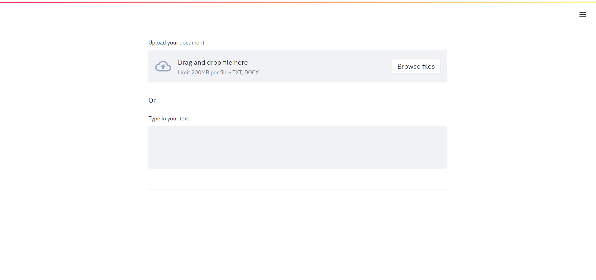
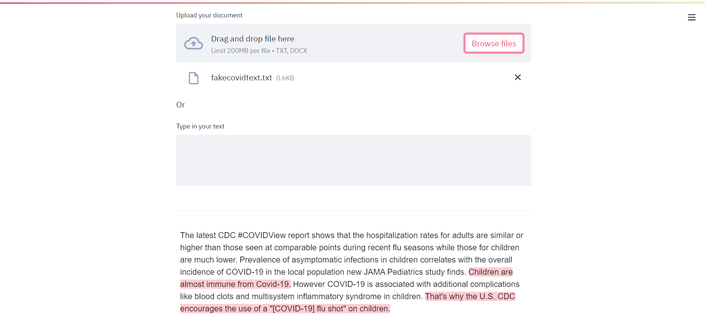
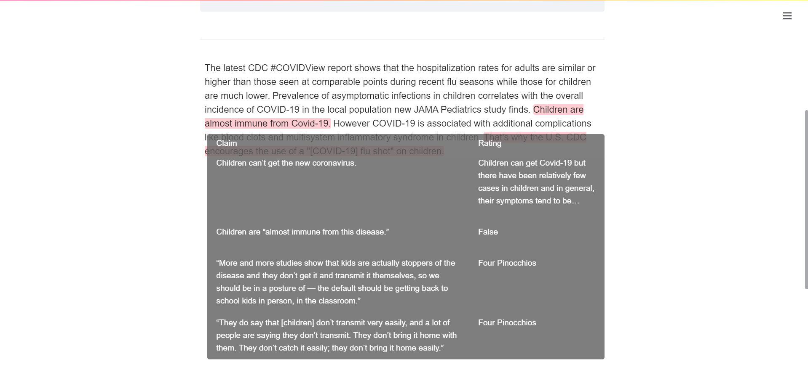

# Fake News detector, using the Streamlit Component Template in Vue.js with Vuetify.js

[Streamlit Vue.js + Vuetify Component template](https://github.com/elip06/streamlit-component-template-vue-vuetify)

Check any COVID-19 related document for potentially dubious claims and validate them using the Google Fact Check Tool

## Setup

[Copy paste](https://github.com/streamlit/component-template#quickstart) of the original component-template quickstart.

- Ensure you have [Python 3.6+](https://www.python.org/downloads/), [Node.js](https://nodejs.org), and [npm](https://docs.npmjs.com/downloading-and-installing-node-js-and-npm) installed.
- Clone this repo.
- Create a new Python virtual environment for the template:

```
$ python3 -m venv venv  # create venv
$ . venv/bin/activate   # activate venv
$ pip install -r requirements.txt # install all needed packages
```

- Initialize and run the component template frontend:

```
$ cd my_component/frontend
$ npm install    # Install npm dependencies
$ npm run serve  # Start the Webpack dev server
```

- From a separate terminal, run the template's Streamlit app:

```
$ . venv/bin/activate  # activate the venv you created earlier
$ streamlit run my_component/__init__.py  # run the example
```

- If all goes well, you should see something like this:
  

- Upload or paste your text to see all dubious claims:
  

- Hover over any highlighted sentence to see which relevant claims were found:
  

- Modify the frontend code at `my_component/frontend/src/MyComponent.vue`.
  - Parameters passed by Python script are made available in `args` props.
- Modify the Python code at `my_component/__init__.py`.
- Feel free to rename the `my_component` folder, `MyComponent.vue` file with its import in `App.vue`, and package name in `setup.py` and `package.json`.

## Resources

- [Higher Order Components in Vue.js](https://medium.com/bethink-pl/higher-order-components-in-vue-js-a79951ac9176)
- [Do we need Higher Order Components in Vue.js?](https://medium.com/bethink-pl/do-we-need-higher-order-components-in-vue-js-87c0aa608f48)
- [Single File Components](https://vuejs.org/v2/guide/single-file-components.html)
- [SFC Spec](https://vue-loader.vuejs.org/spec.html)
- [createElement Arguments](https://vuejs.org/v2/guide/render-function.html#createElement-Arguments)
- [Scoped slots](https://vuejs.org/v2/guide/components-slots.html#Scoped-Slots)
- [Using Slots in Vue.js](https://www.smashingmagazine.com/2019/07/using-slots-vue-js/)
- [Render Functions](https://vuejs.org/v2/guide/render-function.html)
